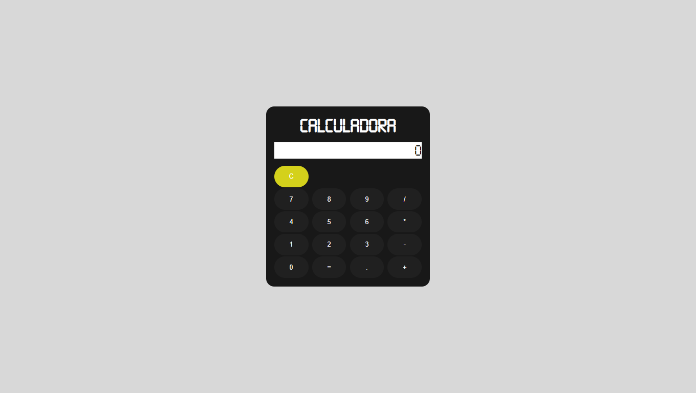
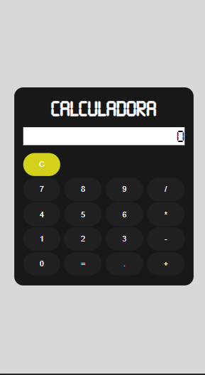

# AppCalculadora

## Projeto simples de Calculadora

 

Status: Concluído. Sujeito à atualizações.

 

Pré-requisito: Navegador atualizado.

 

## Sumário

- [Sobre](#Sobre)
- [Linguagens e Recursos Usados](#Linguagens-e-Recursos-Usados)
- [Links](#Links)
- [Autor](#Autor)

## Sobre

Projeto simples de calculadora responsiva.

#### Desktop 

#### Mobile 

## Linguagens e Recursos Usados
- HTML5
- CSS3
- JavaScript
- jQuery

## Links

- URL do Projeto: [Click here](https://github.com/DouglasReis98/appCalculadora)
- URL da Página: [Click here](https://douglasreis98.github.io/appCalculadora/)

## Autor
- Website - [Douglas Reis](http://douglasreis.epizy.com)
- Frontend Mentor - [@DouglasReis98](https://www.frontendmentor.io/profile/DouglasReis98)
- LinkedIn - [@douglas-reis98](https://www.linkedin.com/in/douglas-reis98/)